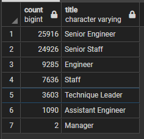
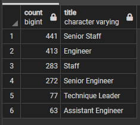

# Pewlett-Hackard-Analysis
A report to help the manager prepare for the upcoming "silver tsunami."

## Overview of the analysis: 
The purpose of this analysis is to determine the number of retiring employees per title, and find which employees are eligible for a new mentorship program at the company "Pewlett-Hackard". With this information there is to be a report on the possible upcoming "Silver Tsunami" and its possible impact on the company

## Results: 
Some Major takeaways:

* There are 33118 Employees at the company total
* There are a very large number of employees who are eligible to retire, totally at 41380.
* Predictably, most of those eligible to retire are Senior Engineers and Senior Staff
* There are far less potential mentors then there are retiring employees

## Summary: 

1. How many roles will need to be filled as the "silver tsunami" begins to make an impact?

2. Are there enough qualified, retirement-ready employees in the departments to mentor the next generation of Pewlett Hackard employees?

As we can see below, there will be far too few mentors for the amount of employees they will be needing

